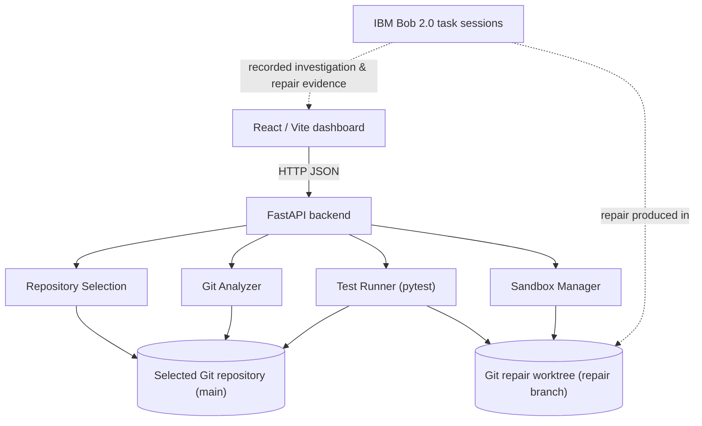

# Codebase ICU

## Explainable Autonomous Software Recovery with IBM Bob 2.0

Codebase ICU turns "the tests are red" into an auditable recovery chain:

```text
Failure → Evidence → Root Cause → Safe Repair → Verified Recovery
```

---

## 1. Project overview

When a test suite fails, developers usually know *that* something broke but
still have to trace, by hand:

```text
failure → execution path → responsible code → introducing commit → safe repair → verification
```

Codebase ICU makes every link in that chain explicit and checkable. It
collects live, deterministic evidence from a Git repository (test results,
commits, diffs, file history), presents IBM Bob 2.0's recorded investigation
of the failure, and verifies the repair by running the test suite inside an
isolated Git worktree — while the broken `main` branch is left untouched.

## 2. Core idea

| Stage | What happens | Where the evidence comes from |
|---|---|---|
| **Failure** | The repository's pytest suite is run and failing tests are listed with their reasons | Live, Codebase ICU backend |
| **Evidence** | Test output, source location, commit metadata and diffs | Live, Codebase ICU backend |
| **Root Cause** | The defect and the commit that introduced it | Recorded IBM Bob investigation, backed by the live commit/diff |
| **Safe Repair** | The fix, on its own branch in a separate Git worktree | Repair branch/worktree, diff read live from Git |
| **Verified Recovery** | Tests re-run inside the repair worktree and compared with `main` | Live, Codebase ICU backend |

The dashboard always distinguishes three kinds of evidence:

1. **Live Codebase ICU evidence** — produced on demand by the backend.
2. **Recorded IBM Bob investigation evidence** — produced in IBM Bob task sessions.
3. **Live repair verification** — the repair worktree's tests, run on demand.

## 3. Why IBM Bob 2.0

IBM Bob 2.0 is the AI investigation and repair component of Codebase ICU. In
IBM Bob task sessions, Bob was used to:

- investigate the root cause of the failing tests;
- reason over test output, source code and Git history together;
- trace the failure through the execution path;
- identify the regression and the commit that introduced it;
- produce the repair;
- validate the isolated recovery workflow (repair in a worktree, `main` unchanged).

**Important:** the Codebase ICU backend does **not** call IBM Bob
programmatically. Bob's work is captured as recorded evidence — the task/session
screenshots in [`bob_sessions/`](bob_sessions/) and the investigation details
shown on the dashboard — and Codebase ICU independently re-verifies it with
live Git and test evidence.

## 4. Architecture



- **Dashboard** (`codebase-icu/frontend`) — one page, one button
  (**RUN RECOVERY ANALYSIS**), four stages.
- **Backend** (`codebase-icu/backend`) — deterministic services only; no AI:
  - **Repository Selection** — validates and holds the repository being analyzed.
  - **Git Analyzer** — read-only status, commits, commit details, diffs, file history.
  - **Test Runner** — runs `pytest -q` and parses results into structured data.
  - **Sandbox Manager** — creates, finds and removes isolated Git worktrees.
- **IBM Bob 2.0** — contributes recorded investigation/repair evidence; it is
  not an API call made by the backend.

## 5. Features

- Select a local Git repository from the dashboard (runtime, validated by the backend)
- Repository status inspection (branch, clean/dirty, changed files)
- Run the repository's pytest suite and parse passed/failed/skipped/errors, failing test names and reasons
- Structured errors when a suite can't run (no tests, collection errors, timeout)
- Git commit listing, commit details, per-commit diffs and file history
- Isolated Git worktree repair sandboxes (create, look up, delete), including worktrees created outside Codebase ICU
- Run tests inside a repair sandbox and compare broken `main` against the repaired sandbox
- IBM Bob investigation evidence for the primary Payment API demo
- Repository-local recovery metadata for the Inventory API validation repair (`.codebase-icu/recovery.json` on its repair branch)
- One-click Windows launcher (`start-codebase-icu.bat`)

## 6. Repository structure

```text
Payment_API/
├── codebase-icu/               Codebase ICU application
│   ├── backend/                FastAPI app (main.py, models.py) and services/
│   │   └── services/           git_analyzer, test_runner, sandbox_manager, repository_selection
│   ├── frontend/               React/Vite dashboard (src/components, src/services/api.js, src/config/demo.js)
│   ├── tests/                  backend pytest suite (uses disposable temp repositories)
│   ├── requirements.txt        backend dependencies
│   └── README.md               detailed backend documentation
├── target-app/                 Payment API — the intentionally broken demo application
├── bob_sessions/               IBM Bob 2.0 task/session screenshots (hackathon evidence)
└── start-codebase-icu.bat      one-click Windows launcher (backend + dashboard)
```

The Payment API repair lives outside this folder, in a Git worktree on its own
branch: `codebase-icu/repair-expired-token`, checked out at `../repair-sandbox`.

## 7. Prerequisites

- **Windows** — recommended; required for the one-click launcher
- **Python** (with `venv` and `pip`)
- **Node.js and npm**
- **Git** (with `git worktree` support)

Tested with Python 3.11 and Node.js 22.

## 8. Installation

From a fresh clone:

```bat
git clone https://github.com/SirishmaA1284/Payment_API.git
cd Payment_API

rem Backend
cd codebase-icu
python -m venv .venv
.venv\Scripts\activate
pip install -r requirements.txt

rem Frontend
cd frontend
npm install
cd ..\..
```

The backend virtual environment is also used to run the target application's
tests, so it already contains everything the Payment API tests need
(FastAPI, httpx, pytest).

To recreate the repair sandbox in a fresh clone (the repair branch is kept
separate from `main` on purpose):

```bat
git fetch origin codebase-icu/repair-expired-token:codebase-icu/repair-expired-token
git worktree add ..\repair-sandbox codebase-icu/repair-expired-token
```

## 9. Running Codebase ICU

### Easiest: one-click launcher

Double-click **`start-codebase-icu.bat`** in the repository root. It opens two
windows — the backend and the dashboard — then open:

- Dashboard: **http://localhost:5173**
- Backend API: http://127.0.0.1:8000 (interactive docs at http://127.0.0.1:8000/docs)

### Command line

```bat
rem Terminal 1 — backend
cd codebase-icu
.venv\Scripts\activate
uvicorn backend.main:app --reload

rem Terminal 2 — dashboard
cd codebase-icu\frontend
npm run dev
```

## 10. How to use the dashboard

1. Start Codebase ICU and open **http://localhost:5173**. The header shows
   **Backend Connected**.
2. The **Repository** field is prefilled with the repository currently
   selected (the Payment API demo, `...\Payment_API\target-app`). To analyze
   another one, enter its full local path.
3. Click **RUN RECOVERY ANALYSIS** (or press Enter). The path is sent to the
   backend first; if it isn't a valid local Git repository, the reason is
   shown under the field and nothing else runs.
4. **Failure** — review the failing tests and their reasons.
5. **IBM Bob Investigation / Root Cause** — when a recorded investigation
   exists, review Bob's evidence and the root-cause commit and diff.
6. **Safe Repair** — review the repair diff, repair branch and sandbox.
7. **Verification** — compare `main` against the repair sandbox.
8. Confirm the sandbox passes while `main` is unchanged and still failing.

For a repository without recorded Bob evidence, the dashboard shows live test
results followed by **"No Recorded Investigation"**. This is expected:
Codebase ICU can analyze any repository live, but it does not invent an
IBM Bob investigation that hasn't happened.

## 11. Primary hackathon demo — Payment API

`target-app/` is a small FastAPI payment API with a deliberate regression.

| | |
|---|---|
| **main** | **9 passed / 2 failed** |
| Failing tests | `tests/test_auth.py::test_profile_with_expired_token`, `tests/test_auth.py::test_expired_token_is_rejected_as_unauthorized` |
| Expected | expired token → **HTTP 401** |
| Actual | expired token → **HTTP 500** |
| Root cause | In `target-app/app/auth.py`, the expired-token handler in `get_current_user()` logs `time.time() - issued_at`, but `issued_at` is not defined in that scope. The resulting `NameError` is raised before the intended `HTTPException(401)`, so the client gets a 500. |
| Introducing commit | `9af9184` — *Add audit logging for expired-token attempts* |
| Repair | Remove the invalid `issued_at` reference from the log call |
| Repair branch | `codebase-icu/repair-expired-token` |
| Repair commit | `fe69a0b` — *Fix NameError in expired-token handler: remove out-of-scope issued_at reference* |
| Repair sandbox | `../repair-sandbox` → **11 passed / 0 failed** |

`main` deliberately stays broken and the repair is **never merged**, so the
dashboard can demonstrate the full recovery — broken `main` versus verified
repair — at any time.

## 12. Demo flow for judges

1. Start Codebase ICU (`start-codebase-icu.bat`) and open http://localhost:5173.
2. Show the Repository field pointing at the Payment API (`target-app`).
3. Click **RUN RECOVERY ANALYSIS**.
4. **Failure:** 2 failing expired-token tests (500 instead of 401).
5. **IBM Bob Investigation:** Bob's test, source and Git evidence.
6. **Root Cause:** commit `9af9184` and its diff in `auth.py`.
7. **Safe Repair:** commit `fe69a0b` on `codebase-icu/repair-expired-token`, in the `repair-sandbox` worktree.
8. **Verification:** `main` 9/11 versus sandbox 11/11.
9. **MAIN UNCHANGED:** the repair was verified in isolation and never merged.

## 13. Inventory API validation (second repository)

A separate, independent repository used to validate runtime repository
selection. It is **not** the primary hackathon demo and is not part of this
GitHub repository.

| | |
|---|---|
| Location | `D:\CodebaseICU-Validation\inventory-api` (local) |
| main | `c48770a` — **3 passed / 1 failed** |
| Failing test | `tests/test_inventory.py::test_missing_item_returns_404` |
| Expected / actual | **404** / **500** |
| Root cause | `item_id` is referenced out of scope in `item_not_found_handler()`, raising a `NameError` |
| Repair branch | `codebase-icu/repair-inventory` (worktree `D:\CodebaseICU-Validation\inventory-api-repair`) |
| Repair commit | `9f136d2` — **4 passed / 0 failed** |
| Recovery record | `.codebase-icu/recovery.json`, committed on the repair branch only |

**Provenance:** IBM Bob investigated the failure and produced the
investigation report, and applied the fix in the repository's working tree.
The identical fix was then moved into the isolated repair worktree and
committed there as `9f136d2`; IBM Bob did not create that commit. `main` was
restored and still fails as intended.

Entering `D:\CodebaseICU-Validation\inventory-api` in the Repository field
shows its live 3/1 test result followed by "No Recorded Investigation" — the
dashboard does not yet read `recovery.json` (see Known limitations).

## 14. Safety and isolation

- Repairs are made and tested in **Git worktrees** on their own branches,
  outside the source repository.
- `main` is never overwritten by Codebase ICU, and repairs are **never merged
  automatically** — merging is always a human decision.
- Tests are run **before** (on `main`) and **after** (in the repair worktree),
  live, every time the analysis runs.
- Git history provides the audit trail: introducing commit, repair commit,
  repair branch.
- All Git and test commands run as argument lists with no shell; the
  repository path is treated purely as a filesystem path, and Git references
  and file paths are validated. API responses never include environment
  variables or secrets.

## 15. API overview

Backend: `http://127.0.0.1:8000` (OpenAPI docs at `/docs`).

| Method | Path | Description |
|---|---|---|
| GET | `/health` | Liveness check |
| GET | `/repository` | Currently selected repository: `path`, `repo_root`, `branch`, `is_default` |
| POST | `/repository/configure` | Select the repository to analyze — body `{"path": "<absolute local path>"}` |
| GET | `/repository/status` | Branch, clean/dirty state, changed files |
| GET | `/repository/commits?limit=&branch=` | Recent commits, newest first |
| GET | `/repository/commits/{commit_hash}` | Commit metadata, parents, changed files, stat |
| GET | `/repository/diff/{commit_hash}` | Unified diff of one commit |
| GET | `/repository/file-history?path=&limit=` | Commits that modified a file |
| POST | `/tests/run` | Run `pytest -q` in the selected repository; structured results |
| POST | `/sandbox/create` | Create an isolated worktree on a new `codebase-icu/sandbox-<id>` branch |
| GET | `/sandbox/{sandbox_id}` | Sandbox path, branch, commit, status |
| DELETE | `/sandbox/{sandbox_id}` | Remove a sandbox created by Codebase ICU |
| POST | `/sandbox/{sandbox_id}/tests` | Run the test suite inside a sandbox |

More detail: [`codebase-icu/README.md`](codebase-icu/README.md).

## 16. Testing

```bat
rem Codebase ICU backend
cd codebase-icu
.venv\Scripts\activate
pytest -q

rem Dashboard unit tests and production build
cd codebase-icu\frontend
npm run test
npm run build

rem Payment API (from the repository root)
cd target-app
..\codebase-icu\.venv\Scripts\python.exe -m pytest -q

rem Payment API repair sandbox
cd ..\..\repair-sandbox\target-app
..\..\Payment_API\codebase-icu\.venv\Scripts\python.exe -m pytest -q
```

Expected: backend and dashboard tests all pass; the build succeeds; the
Payment API gives **9 passed / 2 failed** — the two failures are
**intentional** and are what the demo recovers from; the repair sandbox gives
**11 passed / 0 failed**.

## 17. Known limitations

- IBM Bob is **not invoked programmatically** by the backend; Bob's
  investigation is recorded evidence and must already exist.
- The dashboard's recorded Bob evidence is wired for the Payment API demo
  only (`codebase-icu/frontend/src/config/demo.js` plus panel text). Other
  repositories — including the Inventory API — show **"No Recorded
  Investigation"**, which is expected. The Inventory API's
  `recovery.json` is not yet read by the dashboard.
- Repository selection is **runtime and in-memory**: restarting the backend
  returns to the Payment API demo.
- Test execution targets **pytest / Python** projects, using the backend's
  Python environment — a selected repository's dependencies must be installed there.
- Repair sandboxes rely on **Git worktrees**.
- Running a repository's tests executes that repository's code; only analyze
  repositories you trust.

## 18. Hackathon evidence

[`bob_sessions/`](bob_sessions/) holds screenshots of the IBM Bob 2.0 task
sessions for the Payment API recovery:

| Screenshot | Shows |
|---|---|
| `01_root_cause_failure.png` | Root cause: `issued_at` referenced out of scope in `get_current_user()`'s expired-token handler → `NameError` → 500 |
| `02_git_evidence.png` | Git evidence: commit `9af9184` and its one-line diff to `auth.py` |
| `03_execution_trace.png` | Step-by-step execution trace from `GET /profile` with an expired token to the 500 response |
| `04_evidence_conclusion.png` | Evidence-based conclusion confirmed by test output, source code and Git history |
| `05_safe_repair.png` | The one-line repair in `auth.py` and why it's safe; repair commit `fe69a0b` |
| `06_repair_verification.png` | Verification: `main` 9 passed / 2 failed vs sandbox 11 passed / 0 failed, per-test results |
| `07_isolation_proof.png` | Isolation proof: `main` clean and unchanged; repair branch exactly one commit ahead; full recovery chain |

## 19. Tech stack

- **Backend:** Python, FastAPI, Uvicorn, Pydantic, pytest, httpx
- **Frontend:** React 18, Vite 5, Vitest, plain CSS
- **Target app:** Python, FastAPI, SQLite (`sqlite3`), pytest
- **Tooling:** Git (worktrees), Windows batch launcher
- **AI:** IBM Bob 2.0 (investigation and repair, via task sessions)

## 20. Summary

Codebase ICU turns debugging from "an AI suggested a patch" into an auditable
recovery chain:

```text
Failure → Evidence → Root Cause → Isolated Repair → Verified Recovery
```

Every step is backed by live Git and test evidence, IBM Bob's reasoning is
preserved as recorded evidence, and the broken `main` is never touched.
